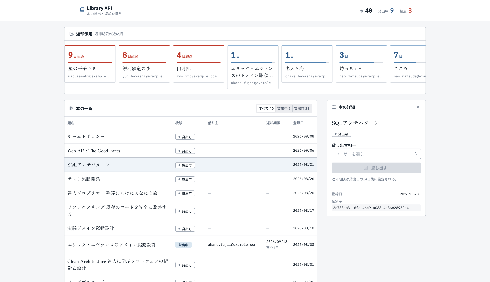
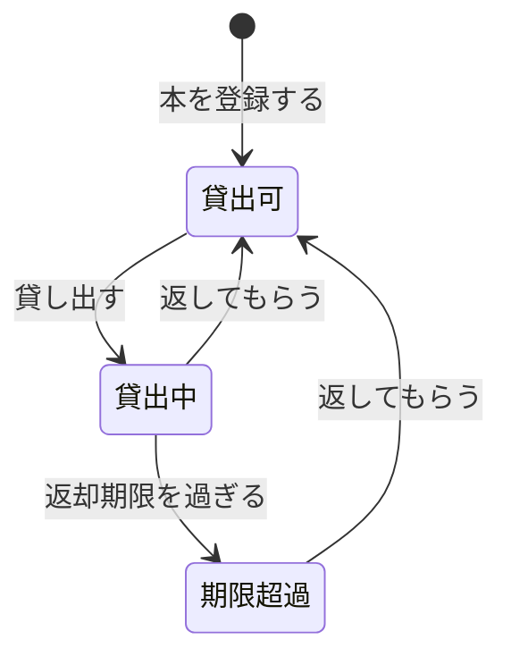
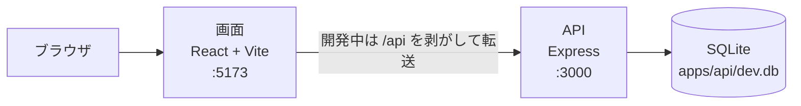
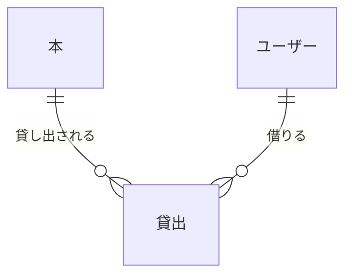

# Library API

本の登録、貸出、返却を扱う HTTP API と、貸出状況を一覧するウェブ画面。
業務ルールを Express と Prisma から切り離すため、クリーンアーキテクチャで4つの層に分けている。



## できること

画面は1枚で、上段が返却予定、その下が左に本の一覧、右に詳細の列という構成になっている。
返却予定は貸出中の本を返却期限の近い順に並べ、期限までの日数と貸出期間の進み具合を出す。

| 操作 | 画面 | API |
| --- | --- | --- |
| 本の登録 | ○ | `POST /books` |
| 本の貸出 | ○ | `POST /loans` |
| 本の返却 | ○ | `POST /loans/return` |
| 本の一覧 | ○ | `GET /books` |
| 本の取得 | | `GET /books/:id` |
| ユーザーの一覧 | | `GET /users` |
| ユーザーの作成 | | `POST /users` |

画面に出ている値の意味は [画面](docs/screen.md) にある。

### 本の状態



期限超過は、返却期限と現在時刻から画面側で判定する。
保存されている状態としては、貸出中と変わらない。

### 業務ルール

- 貸出中の本は再度貸し出せない
- 返却済みの貸出履歴は再度返却できない
- 返却期限は貸出日の14日後
- 同一ユーザーの同時貸出は5冊まで

## 設計

API と画面は別のプロセスで動く。
画面からの要求はすべて `/api` の下に出し、開発中は画面の開発サーバーが API へ転送する。



扱う実体は3つで、貸出が本とユーザーを結ぶ。



依存の向きは `Infrastructure → Adapter → Application → Domain` で、内側の層は外側の層を参照しない。
層ごとの責務と要求の流れは [アーキテクチャ](docs/clean-architecture.md)、採った案と退けた案は [設計判断](docs/design-decisions.md) にある。

## 技術スタック

| 分類 | 技術 |
| --- | --- |
| 言語 | TypeScript 7（ESM） |
| 実行環境 | Node.js 24（`mise.toml` で固定） |
| パッケージ管理 | npm ワークスペース |
| Web フレームワーク | Express 5.2 |
| ORM | Prisma 7.10 |
| データベース | SQLite（`better-sqlite3` 12.6） |
| 入力検証 | Zod 4.6 |
| API 仕様 | OpenAPI 3.0.3 |
| 画面 | React 19.3、Vite 8.3、TanStack Router 1.170 |
| 画面の部品 | Mantine 9.6、Lucide 1.46 |
| 書体 | Zen Old Mincho、Noto Sans JP、IBM Plex Mono |
| 初期データ | Faker 10.6 |
| テスト | Vitest 5.0 |
| 静的検査 | Biome 2.5 |

## セットアップ

```bash
git clone https://github.com/nemonsoon/library-api.git
cd library-api

npm install

cp apps/api/.env.example apps/api/.env

npm run db:push
npm run db:seed
```

API を先に起動し、別の端末で画面を起動する。

```bash
npm run dev:api    # http://localhost:3000
npm run dev:web    # http://localhost:5173
```

`http://localhost:5173` を開くと、上の写真の画面になる。
初期データの内訳と、日々の検査の走らせ方は [開発](docs/development.md) にある。

## API 仕様

起動中の API が、仕様を2つの形で配信する。

| URL | 内容 |
| --- | --- |
| `http://localhost:3000/docs` | Swagger UI。各エンドポイントをブラウザ上で試せる |
| `http://localhost:3000/openapi.yml` | OpenAPI 仕様そのもの |

仕様の原本は [`apps/api/openapi.yml`](apps/api/openapi.yml)。

## 現在の制約

ローカル実行を想定しており、本番環境への配備は行っていない。
以下は未実装で、[Issues](https://github.com/nemonsoon/library-api/issues) で管理している。

| 未実装のもの | 影響 |
| --- | --- |
| 認証と認可 | 任意のユーザーの識別子を指定すれば、誰でも貸出と返却ができる |

一覧を返す2つのエンドポイントは、本とユーザーの全件をそのまま返す。
ページングも絞り込みの引数も持たない。

## ドキュメント

| 文書 | いつ読むか |
| --- | --- |
| [画面](docs/screen.md) | 画面に出ている値の意味を確かめるとき |
| [アーキテクチャ](docs/clean-architecture.md) | 層の責務と依存の向きを確かめるとき |
| [設計判断](docs/design-decisions.md) | 「なぜそうなっていないか」を知りたいとき |
| [開発](docs/development.md) | 手元で動かし、変更を検査するとき |

## ライセンス

[MIT](LICENSE)
