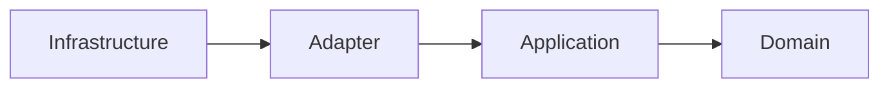
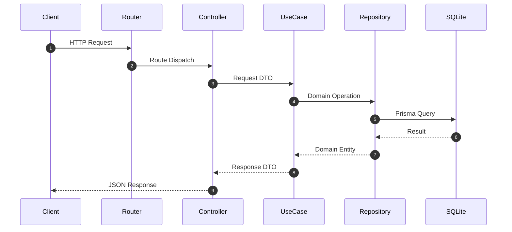
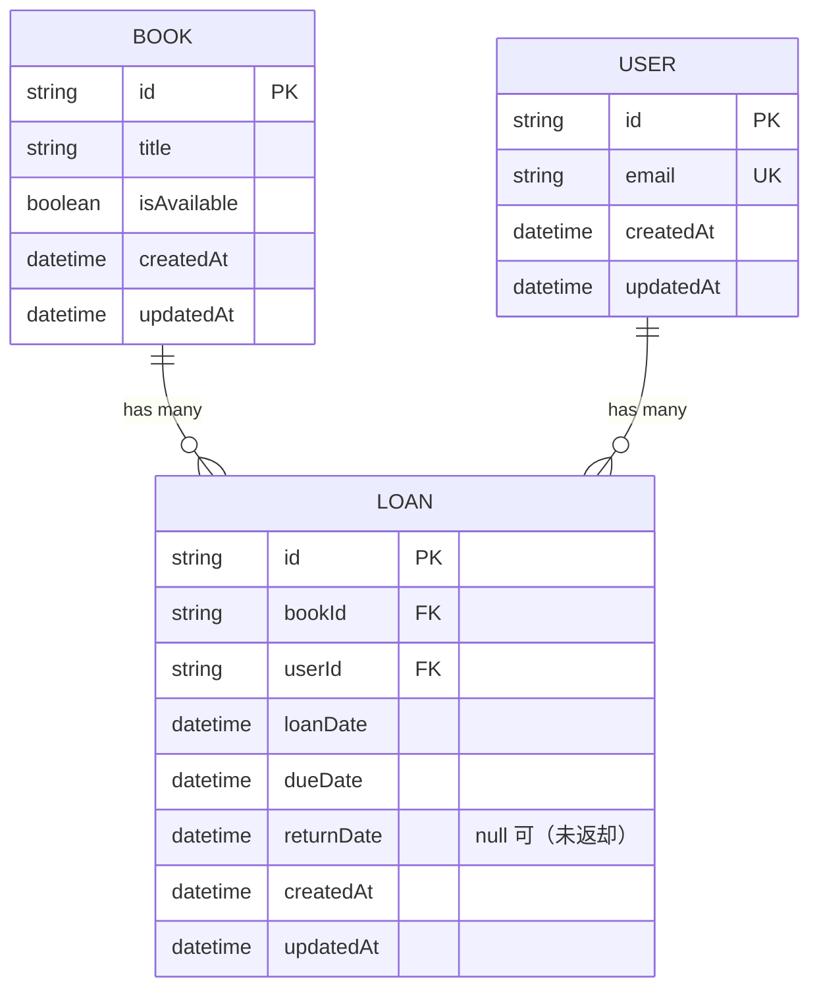

# Library API

書籍の登録・貸出・返却を扱う HTTP API。
クリーンアーキテクチャで層を分離し、業務ルールをフレームワークやデータベースから独立させることを設計の軸に置いている。

## 機能

- ユーザーの作成
- 書籍の登録
- 書籍の取得
- 書籍の貸出
- 書籍の返却

### 業務ルール

- 貸出中の書籍は再度貸し出せない
- 返却済みの貸出履歴は再度返却できない
- 返却期限は貸出日の14日後
- 同一ユーザーの同時貸出は5冊まで

## 現在の制約

ローカル実行を想定しており、本番環境への配備は行っていない。
以下は未実装で、それぞれ [Issues](https://github.com/nemonsoon/library-api/issues) で管理している。

| 未実装のもの | 影響 |
| --- | --- |
| 認証・認可 | 任意のユーザーの識別子を指定すれば、誰でも貸出と返却ができる |
| リクエストの入力検証 | 必須項目が欠けたリクエストが業務ロジックまで到達する |
| 業務エラーに応じた HTTP ステータス | 書籍の未存在を除き、すべて `500` を返す |
| 主要な業務ルールの自動テスト | 再貸出の禁止、再返却の禁止、同時貸出の上限、返却期限が壊れても検知できない |

## アーキテクチャ

依存の向きは `Infrastructure → Adapter → Application → Domain`。
内側の層は外側の層を参照しない。

| 層 | 責務 | ディレクトリ |
| --- | --- | --- |
| Domain | エンティティ、業務ルール、抽象インターフェース | `src/domain` |
| Application | ユースケース、DTO、トランザクションの抽象 | `src/application` |
| Adapter | Controller、Repository の実装、ユーティリティの実装 | `src/adapter` |
| Infrastructure | Express の起動、依存性の組み立て、ルーティング | `src/infrastructure` |

依存性の組み立ては `src/infrastructure/web/app.ts` に集約している。

### 依存方向



### リクエストの流れ



### データモデル



スキーマの定義は `prisma/schema.prisma` にある。

## 技術スタック

| 分類 | 技術 |
| --- | --- |
| 言語 | TypeScript（ESM） |
| 実行環境 | Node.js 24（`mise.toml` で固定） |
| Web フレームワーク | Express 5 |
| ORM | Prisma 7 |
| データベース | SQLite（`@prisma/adapter-better-sqlite3`） |
| API 仕様 | OpenAPI（`openapi.yml`） |
| テスト | Vitest |
| 静的検査 | Biome |

## セットアップ

```bash
git clone https://github.com/nemonsoon/library-api.git
cd library-api

npm install

cp .env.example .env

npx prisma generate
npx prisma db push

npm run dev
```

起動後のベース URL は `http://localhost:3000`。

環境変数は `.env.example` をコピーして設定する。

| 変数 | 用途 | 例 |
| --- | --- | --- |
| `DATABASE_URL` | SQLite の接続先 | `file:./dev.db` |
| `PORT` | 待ち受けポート | `3000` |

## API ドキュメント

起動中のサーバーが、API 仕様を2つの形で配信する。

| URL | 内容 |
| --- | --- |
| `http://localhost:3000/docs` | Swagger UI。ブラウザ上で各エンドポイントを試せる |
| `http://localhost:3000/openapi.yml` | OpenAPI 仕様そのもの |

仕様の原本はリポジトリ直下の [`openapi.yml`](openapi.yml)。

### エンドポイント

| Method | Path | 説明 | 成功時のステータス |
| --- | --- | --- | --- |
| POST | `/users` | ユーザーの作成 | `201` |
| POST | `/books` | 書籍の登録 | `201` |
| GET | `/books/:id` | 書籍の取得 | `200` |
| POST | `/loans` | 書籍の貸出 | `201` |
| POST | `/loans/return` | 書籍の返却 | `200` |

### リクエスト例

```bash
# ユーザーの作成
curl -X POST http://localhost:3000/users \
  -H 'Content-Type: application/json' \
  -d '{"email":"user@example.com"}'

# 書籍の登録
curl -X POST http://localhost:3000/books \
  -H 'Content-Type: application/json' \
  -d '{"title":"Clean Architecture"}'

# 書籍の貸出
curl -X POST http://localhost:3000/loans \
  -H 'Content-Type: application/json' \
  -d '{"bookId":"<書籍の識別子>","userId":"<ユーザーの識別子>"}'

# 書籍の返却
curl -X POST http://localhost:3000/loans/return \
  -H 'Content-Type: application/json' \
  -d '{"id":"<貸出の識別子>"}'
```

### エラーレスポンス

形式は `{ "error": "..." }`。

現在のステータスの割り当ては次のとおりで、業務エラーの区別は未対応。

- `GET /books/:id` で書籍が存在しないとき `404`
- それ以外の業務エラーと例外は `500`

## 開発コマンド

```bash
npm run dev        # 開発サーバー起動（tsx）
npm test           # テスト実行（Vitest）
npm run typecheck  # 型検査（tsc --noEmit）
npm run check      # 静的検査（Biome、書き換えなし）
npm run lint:fix   # 静的検査と自動修正（Biome）
```

## ライセンス

[MIT](LICENSE)
