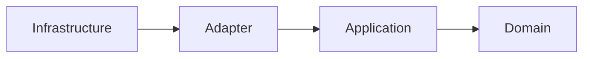
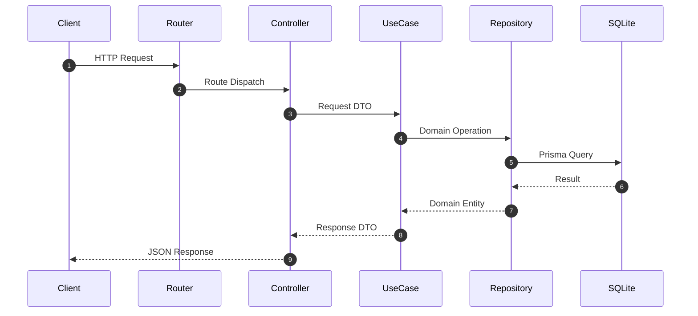
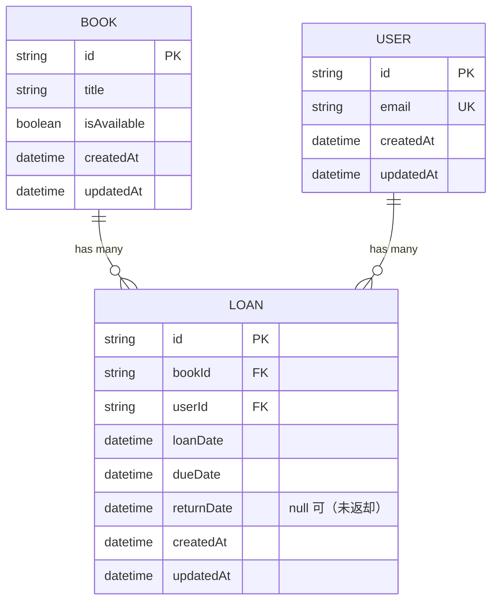

# Library API

書籍の登録・貸出・返却を扱う HTTP API。
クリーンアーキテクチャで層を分離し、業務ルールをフレームワークやデータベースから独立させることを設計の軸に置いている。

## 機能

- ユーザーの作成
- ユーザーの一覧
- 書籍の登録
- 書籍の取得
- 蔵書の一覧（各書籍の貸出状況つき）
- 書籍の貸出
- 書籍の返却

### 業務ルール

- 貸出中の書籍は再度貸し出せない
- 返却済みの貸出履歴は再度返却できない
- 返却期限は貸出日の14日後
- 同一ユーザーの同時貸出は5冊まで

## 現在の制約

ローカル実行を想定しており、本番環境への配備は行っていない。
以下は未実装で、それぞれ [Issues](https://github.com/nemonsoon/library-api/issues) で管理している。

| 未実装のもの | 影響 |
| --- | --- |
| 認証・認可 | 任意のユーザーの識別子を指定すれば、誰でも貸出と返却ができる |

一覧を返す2つのエンドポイントは、蔵書の全件をそのまま返す。
ページングも絞り込みの引数も持たない。

## アーキテクチャ

依存の向きは `Infrastructure → Adapter → Application → Domain`。
内側の層は外側の層を参照しない。

| 層 | 責務 | ディレクトリ |
| --- | --- | --- |
| Domain | エンティティ、業務ルール、抽象インターフェース | `apps/api/src/domain` |
| Application | ユースケース、DTO、トランザクションの抽象 | `apps/api/src/application` |
| Adapter | Controller、Repository の実装、入力検証 | `apps/api/src/adapter` |
| Infrastructure | Express の起動、依存性の組み立て、ルーティング | `apps/api/src/infrastructure` |

依存性の組み立ては `apps/api/src/infrastructure/web/app.ts` に集約している。

### エラーの置き場所

業務ルールに反する操作は Domain 層の例外が表す。
「貸出中の書籍は貸し出せない」という判断は `Book` 自身が下し、HTTP の知識は持たない。

操作の前提となる対象が無いことは Application 層の例外が表す。
Repository は見つからないことを例外にせず `null` を返す。
0件が正常な一覧と、対象が無いという誤りを区別するためである。

リクエストの形の検証は Adapter 層に置く。
「タイトルが文字列か」は形の問題で、「その書籍を貸し出せるか」は業務の問題なので、同じ場所に置くと規則が散らばる。

### 依存方向



### リクエストの流れ



### データモデル



スキーマの定義は `apps/api/prisma/schema.prisma` にある。

## 技術スタック

| 分類 | 技術 |
| --- | --- |
| 言語 | TypeScript（ESM） |
| 実行環境 | Node.js 24（`mise.toml` で固定） |
| パッケージ管理 | npm ワークスペース |
| Web フレームワーク | Express 5 |
| ORM | Prisma 7 |
| データベース | SQLite（`@prisma/adapter-better-sqlite3`） |
| 入力検証 | Zod 4 |
| API 仕様 | OpenAPI（`apps/api/openapi.yml`） |
| テスト | Vitest |
| 静的検査 | Biome |

## セットアップ

```bash
git clone https://github.com/nemonsoon/library-api.git
cd library-api

npm install

cp apps/api/.env.example apps/api/.env

npm run db:push --workspace api
npm run db:seed

npm run dev:api
```

起動後のベース URL は `http://localhost:3000`。

`npm run db:seed` は蔵書と貸出の初期データを投入する。
実行のたびに既存のデータを消してから入れ直すため、同じ状態から始められる。

環境変数は `apps/api/.env.example` をコピーして設定する。

| 変数 | 用途 | 例 |
| --- | --- | --- |
| `DATABASE_URL` | SQLite の接続先 | `file:./dev.db` |
| `PORT` | 待ち受けポート | `3000` |

## API ドキュメント

起動中のサーバーが、API 仕様を2つの形で配信する。

| URL | 内容 |
| --- | --- |
| `http://localhost:3000/docs` | Swagger UI。ブラウザ上で各エンドポイントを試せる |
| `http://localhost:3000/openapi.yml` | OpenAPI 仕様そのもの |

仕様の原本は [`apps/api/openapi.yml`](apps/api/openapi.yml)。

### エンドポイント

| Method | Path | 説明 | 成功時のステータス |
| --- | --- | --- | --- |
| GET | `/users` | ユーザーの一覧 | `200` |
| POST | `/users` | ユーザーの作成 | `201` |
| GET | `/books` | 蔵書の一覧 | `200` |
| POST | `/books` | 書籍の登録 | `201` |
| GET | `/books/:id` | 書籍の取得 | `200` |
| POST | `/loans` | 書籍の貸出 | `201` |
| POST | `/loans/return` | 書籍の返却 | `200` |

`GET /books` は各書籍に `currentLoan` を添える。
返却されていない貸出があれば借り主と貸出日と返却期限が入り、無ければ `null` になる。
詳細を表示する呼び出し側が、書籍ごとに追加の取得をしなくて済む。

### リクエスト例

```bash
# 蔵書の一覧
curl http://localhost:3000/books

# ユーザーの作成
curl -X POST http://localhost:3000/users \
  -H 'Content-Type: application/json' \
  -d '{"email":"user@example.com"}'

# 書籍の登録
curl -X POST http://localhost:3000/books \
  -H 'Content-Type: application/json' \
  -d '{"title":"Clean Architecture"}'

# 書籍の貸出
curl -X POST http://localhost:3000/loans \
  -H 'Content-Type: application/json' \
  -d '{"bookId":"<書籍の識別子>","userId":"<ユーザーの識別子>"}'

# 書籍の返却
curl -X POST http://localhost:3000/loans/return \
  -H 'Content-Type: application/json' \
  -d '{"id":"<貸出の識別子>"}'
```

### エラーレスポンス

形式は `{ "error": "..." }`。

| ステータス | 返す場面 | 例 |
| --- | --- | --- |
| `400` | リクエストの形が仕様と違う | タイトルが空のまま書籍を登録した |
| `404` | 操作の前提となる対象が無い | 存在しない書籍の識別子で貸出を求めた |
| `409` | 業務ルールに反する | 貸出中の書籍を借りようとした、同時貸出が5冊に達している |
| `500` | 想定していない例外 | — |

`409` と `404` の本文には理由がそのまま入るため、呼び出し側は再試行すべきかを判断できる。

## 開発コマンド

```bash
npm run dev:api    # API の開発サーバー起動（tsx）
npm run db:push    # スキーマをデータベースへ反映（Prisma）
npm run db:seed    # 初期データの投入（既存のデータは消える）
npm test           # テスト実行（Vitest）
npm run typecheck  # 型検査（tsc --noEmit）
npm run check      # 静的検査（Biome、書き換えなし）
npm run lint:fix   # 静的検査と自動修正（Biome）
```

`test`、`typecheck`、`check` はリポジトリ直下から全ワークスペースに対して走る。

## ライセンス

[MIT](LICENSE)
