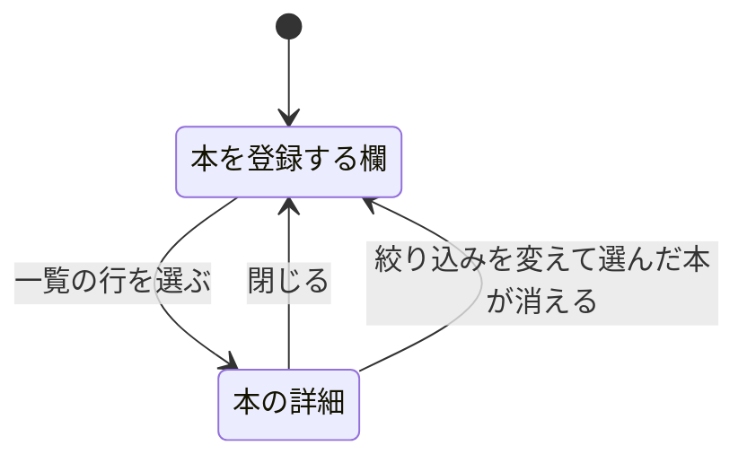

# 画面

画面は1枚で、4つの領域からなる。

| 領域 | 出しているもの |
| --- | --- |
| 見出し | サービスの名前と、本・貸出中・超過の件数 |
| 返却予定 | 貸出中の本を、返却期限の近い順に並べたもの |
| 本の一覧 | 全件を登録日の新しい順に並べた表と、状態の絞り込み |
| 右の列 | 本を登録する欄、または選んだ本の詳細 |

右の列は、一覧の行を選ぶと本を登録する欄から本の詳細に切り替わる。

そう決めた理由は [設計判断](design-decisions.md) にある。

## 返却予定の読み方

1枚につき4つの値を出す。

| 位置 | 出しているもの |
| --- | --- |
| 上端の線 | 返却期限を過ぎていれば朱、期限内なら藍 |
| 数字 | 返却期限までの残りの日数。過ぎていれば超過した日数 |
| 帯 | 貸出期間のうち、どこまで来たか |
| 下の2行 | 本の題名と借り主 |

帯の長さは、貸出日と返却期限の差に対する経過時間の割合で決まる。

並び順は返却期限の近い順である。
超過しているものは返却期限が最も古いので、先頭に出る。

貸出中の本が1冊も無いときは、並べる代わりに1冊も無いことを伝える文が出る。

## 本の状態

状態は3つあり、絞り込みでは2つに畳まれる。

| 状態 | バッジ | 色 | 絞り込みでの扱い |
| --- | --- | --- | --- |
| 貸出可 | 点 | 灰 | 貸出可 |
| 貸出中 | 淡い面 | 藍 | 貸出中 |
| 期限超過 | 塗り | 朱 | 貸出中 |

期限を過ぎているかどうかは、返却期限と現在時刻から画面側で判定する。
保存されている状態としては、期限超過と貸出中は同じである。

## 色と書体

色は4組ある。

| 色 | 表すもの |
| --- | --- |
| 藍 | 貸出中 |
| 朱 | 返却期限の超過 |
| 緑 | 返却 |
| 墨 | 文字、貸出可 |

朱は、超過している貸出があるときだけ画面に出る。

書体は3つある。

| 書体 | 使う場所 |
| --- | --- |
| 明朝 | 本の題名 |
| ゴシック | ラベル、ボタン、説明 |
| 等幅 | 日数、日付、識別子 |

大きさ、太さ、行間、余白、角丸は Mantine の変数をそのまま使う。

## 絞り込みと選んだ本の保持

絞り込みと選んだ本は URL の検索引数に入る。
再読み込みしても、URL を共有しても、同じ絞り込みと同じ本が開く。

| 引数 | 値 |
| --- | --- |
| `status` | `onLoan` または `available`。すべてのときは付かない |
| `selected` | 選んだ本の識別子 |

絞り込みを変えた結果、選んだ本が一覧から消えたときは `selected` が外れる。
